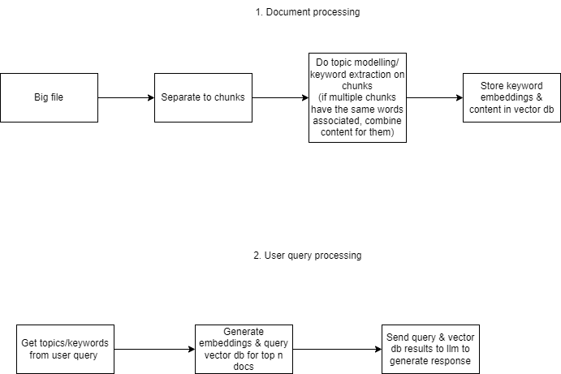
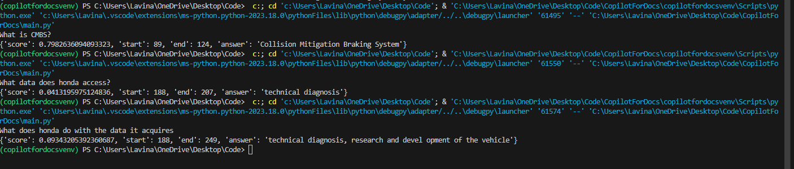

# CopilotForDocs
Creating a copilot to query over docs using vector db, llm &amp; rag techniques

Input Data Source - [Honda city manual](./HondaCityManual.pdf)

LLM to use for getting answer in more human format = [deepset/roberta-base-squad2](https://huggingface.co/deepset/roberta-base-squad2)

Using keyword extraction - [KeyBERT](https://maartengr.github.io/KeyBERT/)

Vector db to use - [Pinecone](https://www.pinecone.io/) -max supported dimensions- 768

Text embedding- [BAAI/bge-base-en-v1.5](https://huggingface.co/spaces/mteb/leaderboard)

**High level flow**

**Results**

